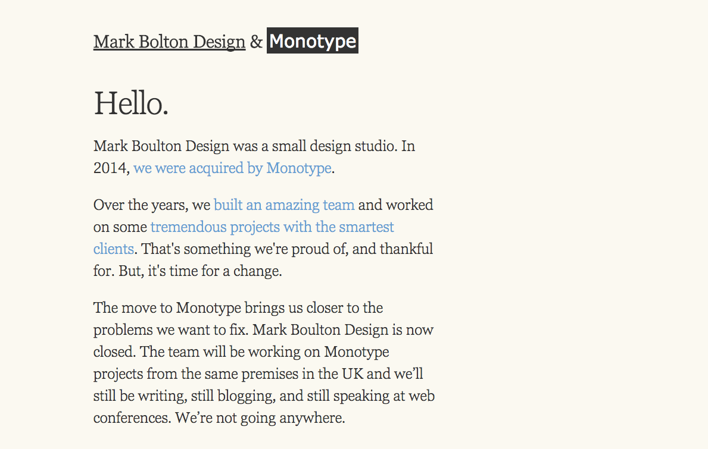
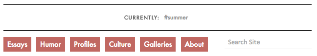
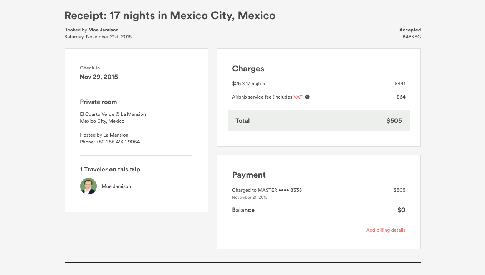

#Basic CSS - Recreating Web Components

###Blog Layout


#####*Design Specs*
```
fonts: Georgia & Geneva
line-height: 1.25
```

<hr/>
###Menu List


#####*Design Specs*
```
fonts: Avenir
color: `#66CC99`
```

<hr/>
###Icon Set


#####*Design Specs*
```
fonts: Georgia & Geneva
images:
  facebook-icon-bw.png
  twitter-icon-bw.png
  stumbleit-icon-bw.png
  googleplus-icon-bw.png
  linkedin-icon-bw.png
```

<hr/>
###Navigation Menu


#####*Design Specs*
```
font: Futura
link background color: rgb(205,92,92)
```

<hr/>
###Multi Column Layout


#####*Design Specs*
```
font: Helvetica Neue
top-bar color: #004
link color: `#DE5233`
```

<hr/>
###Page Layout


#####*Design Specs*
```
font: Avenir
link color: `#ff5a5f`
images:
  random-user1.png
```

