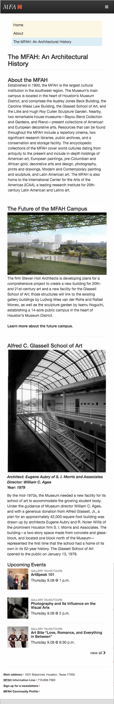

#CSS Basics - Create Layout and Styles form Designer Mockup of Site

###Context
The Museum of Fine Arts Houston wants to create a static webpage talking about their architectural history and current commitments.  

They have provided us with the copy as well as the images and logos, and we will need to place that content on the page with the styles shown in the markup.

###The Assignment
Create the html and CSS for the mockup, making sure that you create a mobile-first layout. Use appropriate margin and padding and use inline-block elements where appropriate.


####The mobile layout



####The full-screen layout


The copywriting text can be found [here](./mfah-architecture-site-copy.txt)

**NOTE: At the top of your stylesheet make sure you apply the style rule `box-sizing: border-box` to *all* elements**

```css
* {
    box-sizing: border-box
}
```

Use the `gen-project.sh` script to create the files and folders for the project. 
