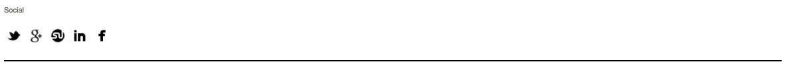

#Assignment 2 - Basic CSS - Recreating Web Components
##Instructions
Use what you've learned of CSS styles and properties to recreate the site components shown below. You likely will need to use CSS properties like:

- `margin`, `padding`, `border`
- `font-family`, `font-size`, `font-weight`, `color`
- `width`, `height`
- `background-color`
- `text-align`
- `display: block` and `display: inline-block`

Recommended Setup:
```sh
cd ~/TIY/assignments
mkdir assignment-02
cd assignment-02
curl https://raw.githubusercontent.com/TIY-Charleston-Front-End-Engineering/Course-Guide/master/assignments/basic-css-web-components/assignment-files.zip > assignment-files.zip
unzip assignment-02
```

**NOTE: make sure you include `*{box-sizing: border-box}*` at the top of your stylesheet**

##Normal Mode

###Simple Article Layout


#####*Design Specs*
```
fonts: Georgia & Geneva
line-height: 1.25
```

<hr/>
###Menu List


#####*Design Specs*
```
fonts: Avenir
color: `#66CC99`
```

<hr/>
###Icon Set


#####*Design Specs*
```
fonts: Georgia & Geneva
images:
  facebook-icon-bw.png
  twitter-icon-bw.png
  stumbleit-icon-bw.png
  googleplus-icon-bw.png
  linkedin-icon-bw.png
```

<hr/>
###Navigation Menu


#####*Design Specs*
```
font: Futura
link background color: rgb(205,92,92)
```

<hr/>
###Multi Column Layout


#####*Design Specs*
```
font: Helvetica Neue
top-bar color: #004
link color: `#DE5233`
```


##Adventurer Mode
<hr/>
###Page Layout


#####*Design Specs*
```
font: Avenir
link color: `#ff5a5f`
images:
  random-user1.png
```

