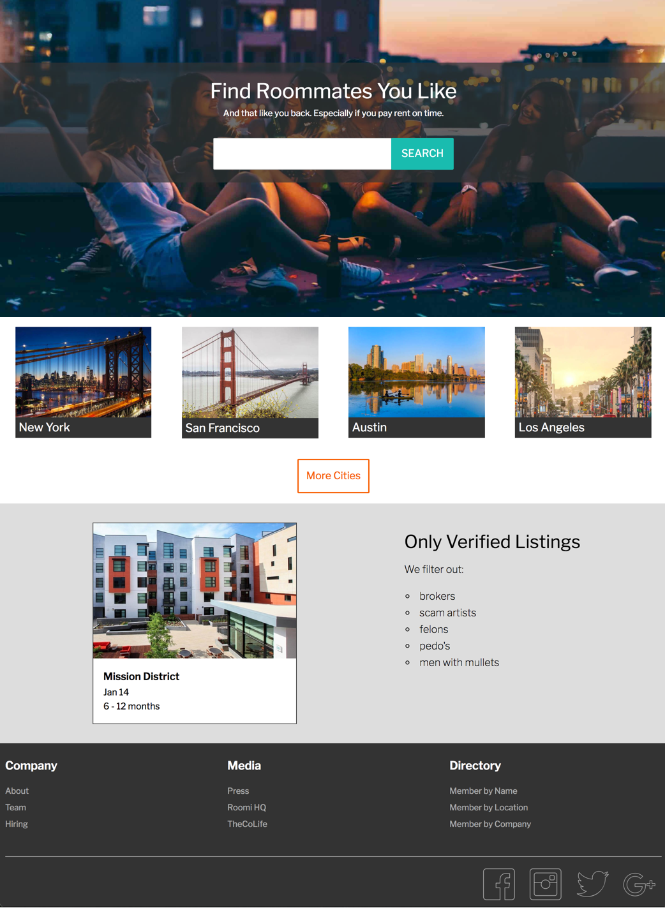

#Stride - Basic Layout + Element Positioning with CSS 

###Description
Stride is a start-up looking to build a web platform to connect roommates of similar interests and compatible lifestyles. They are looking to build a web application similar to Airbnb, but that is based on successful long-term roommate arrangements. They have assembled a backend team to create the business logic, database, and API for the mobile application, and they are now looking for a front-end developer to build a sample static page of the designer's mockup.

###Objectives
####Learning Objectives
After completing this assignment you should:
- Recognize sensible nesting of HTML elements
- Use CSS classes for styling elements on the page.
- Have familiarity with the syntax for common CSS properties like `font-family`, `font-size`, `color`, `background`, `margin`, `padding`, `border`, `border-radius`, `text-align`, and `line-height`.
- Understand the different kinds of display types for an HTML:
  + `block`
  + `inline-block`
  + `inline`
- Understand the CSS box-model with respect to `border`, `padding`, `margin`
- Understand how to use CSS positioning for precise placement of elements
  + `fixed`
  + `absolute`
  + `relative`


####Performance Objectives
To receive a passing grade on this assignment, you must
- Create a static web page that links to a `.css` stylesheet
- Create a faithful representation of the design-mockup with respect to fonts, colors + spacing.
- Have content displayed in multiple columns where shown per the mockup.
- Utilize the `position` property to manipulate the positioning of: 
  + the heart in the upper-right corner of the room-listing example
  + the price in bottom-left corner of the room-listing example 
  + the arrow tab for the *Got Questions* chat box.

##Deliverables
- an `index.html` file with the content
- a `style.css` file
- a repository on github titled `basic-layout-and-positioning-stride`

##Setup

Create the assignment-folder and download the images into the assignment-folder.
```
cd ~/TIY/assignments
mkdir assignment-04
cd assignment-04
curl https://raw.githubusercontent.com/TIY-Charleston-Front-End-Engineering/Course-Guide/master/assignments/basic-layout-and-positioning-stride/images.zip > images.zip 
```

Inside of the `assignment-04/` directory you will need to: 
+ create the `index.html` 
+ `style.css` file in a `css/` folder
+  link the `index.html` file to the `style.css` 

**NOTE:** At the top of your stylesheet make sure you apply the style rule `box-sizing: border-box` to *all* elements

```css
* {
    box-sizing: border-box
}
```


##Part 1 -- Basic Layout


####Note: 
- for the background image on the *Find Roommates You Like*, you will need to add the folowing CSS properties to : 
+ `background-image: url(../images/hero-splash')`
+ `background-size: cover`

(Note: you do not use an `` tag for an element with a background-image, you put  )


##Part 2 -- Navbar + Position Elements on the Page


<hr>
##Additional Designer notes

####Palette
```
orange color: #F55E05
green color: #29BBAF
light-green color: #B0E6E2
font stack : "Libre Franklin", "Helvetica", "sans-serif"
```

####Font 
1. Load the font from googlefonts:

  ```html
  <head>
      ...<!--  your title, meta tags, etc. -->
      <link href="https://fonts.googleapis.com/css?family=Libre+Franklin:200,200i,400,400i,700,700i" rel="stylesheet">
      <link rel="stylesheet" href="./css/styles.css">
  </head>
  ```

2. Reference in `.css`
  ```css
  body {
     font-family:
  }
  ```

##Adventure Mode
+ Use the `:hover` pseudo class to apply hover-styles to the buttons
+ Use the `:focus` pseudo class to apply styles to the border of the input box when it is selected


##Epic Mode

Use media-queries (CSS `@media` rule) so that the site works on mobile devices and at the full wide-screen desktop.

