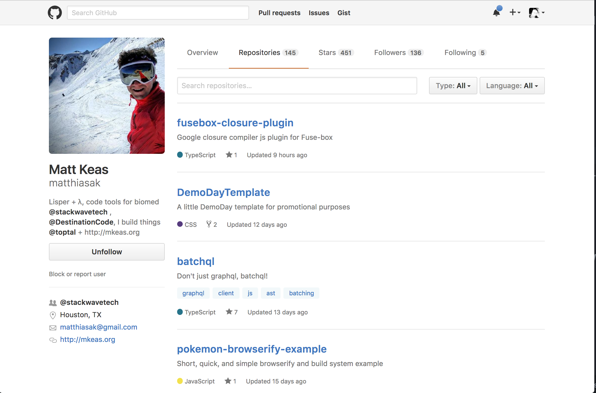

# github-api-profile

## Objectives

After completing this assignment, you should be able to:

* Demonstrate understanding of functions, loops/array
* Be able to breakdown a simple process of procedural steps into a series of statements in JS
* Demonstrate use of Promises and AJAX methods
* Demonstrate ability to update DOM elements and their attributes/innerHTML via JS
* Utilize routing and a controllerRouter() function to simplify your navigation code.

## Details

### Instructions

```sh
# cd into ~/TIY/assignments folder
# git clone https://github.com/t3tools/simple-build-es6-scss assignment-XX
# cd into you assignment folder
# remove the repo's origin 
# hub create to create the repo on Github
# then setup your project files (i.e. run `npm install`)
```

### Deliverables

* A repository on github
* Site styles written in SCSS in the `src/`  and compiled to the dist
* JS written in `src/` and compiled to the dist folder

### Requirements

* No JS errors in the browser
* All functions and code should work according to the following description.


## Normal Mode


#### Part 1
Recreate the HTML and CSS for the Github tab page (https://github.com/matthiasak?tab=repositories) as your design, and using two AJAX requests/Promises, pull your own profile information from Github:

- Your profile: `https://api.github.com/users/«username»`
- Your repos: `https://api.github.com/users/«username»/repos`

After loading data from the Github API, write at least the following information to the DOM:

- name
- blog
- location
- email
- an `` with its source as the avatar_url
- html_url
- for each repo owned by your user, list that repo in a `<ul>`

#### Part 2
You will also need to include an `<input>` tag on your page that will allow users to search for a particular GitHub account. Once the user presses enter in the `<input>` tag, your app should change the hash, which will trigger a new request to the GitHub server, and display information for the corresponding user.

#### Example


<hr/>
###API Notes
1. [Get an API key](https://github.com/settings/tokens/new)
  - Click 'Generate Token', leave all options *unselected*
2. Copy the access token
  - You won't be able to see it again from github!
3. Make sure you can fetch a user from the API with your token
  - https://api.github.com/users/matthiasak?access_token=«your-access-token»

