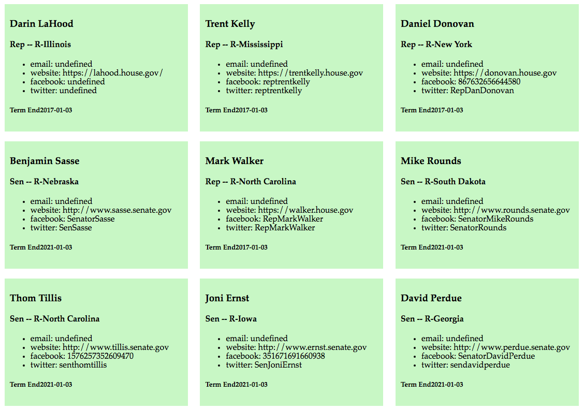

#Intro-APIs

##Objectives

  * Read and explore the documentation of APIs
  * Effectively implement the promise pattern
  * Format retrieved data into HTML

##Setup

* use the `gen-project-scss` tool to create a new web project
* `cd` into the project
* `git init`
* hub create [repoName]
* include a script tag in your `index.html` that links to the jquery source code (make sure you put it *above* your own script)
* hack away at your `app.js` to create the patterns below!
* Note: you will need to use JSONP in your application and format your request with a callback so:
  ```
  https://congress.api.sunlightfoundation.com/legislators?callback=?
  ```

##Resources

 * Sunlight Foundation API: https://sunlightfoundation.com/api/
 * jquery source code: https://code.jquery.com/jquery-2.2.4.min.js

###Normal Mode

Retrieve data on all legislators, reproducing the page shown below: 


###Adventure Mode

Include a text input at the top of your page. If the user enters a ZIP code and types enter, your app should retrieve data on local legislators. See gif below: 


###Master Mode

Reconfigure your api request so that the database only returns 10 requests at once. Add a "see more" button at the bottom of the page. If the user clicks this button, 10 additional congresspersons should be *appended* to the bottom of the list. The user should be able to click for more legislators repeatedly until they exhaust the database (there are 540 legislators total).

Note that for this feature you'll have to use the optional `per_page` and `page` parameters that can be sent with the request.