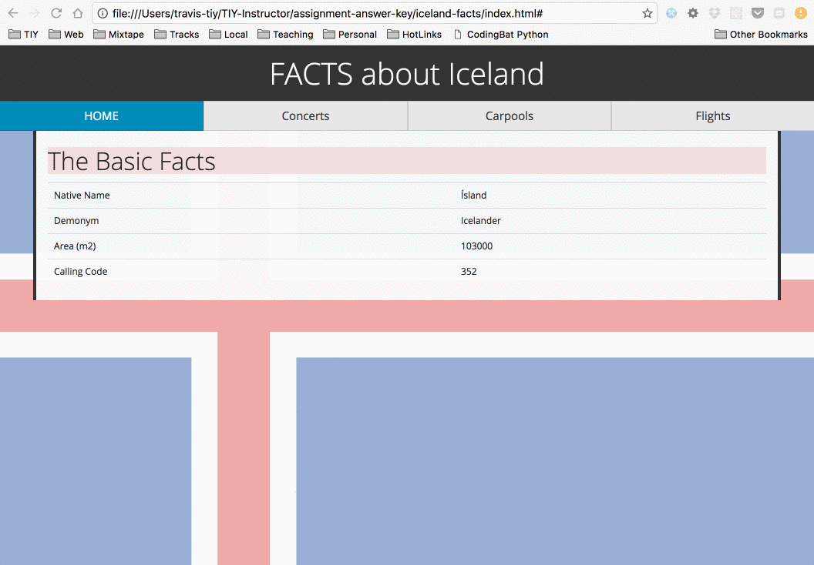
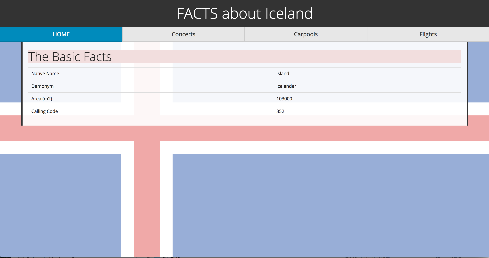
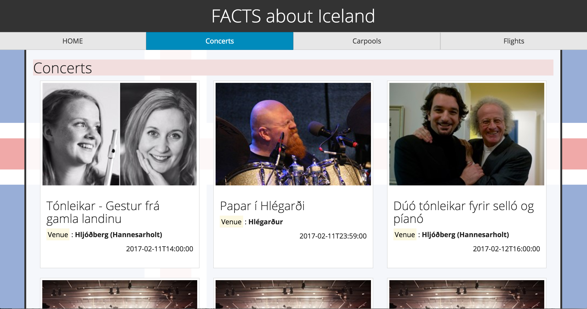
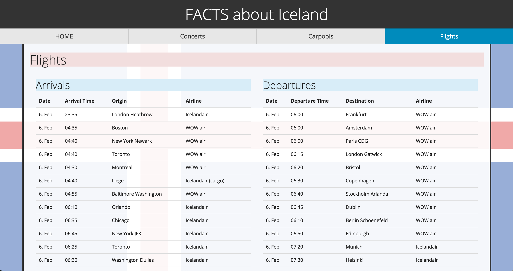

#Intro to Routing and Views with Data

##Objectives

  * Effectively implement the promise pattern for fetching data asynchronously.
  * Format retrieved data into HTML
  * Primary objective is routing + fetching + rendering data to page. Styles are of secondary importance. 
  * Use `window.location.hash` and an event-listener on the `hashchange` event to implement client-side routing.
  * Implement UI-logic that changes the hash base on user interactions.

##Setup

* use the (simple-build-scss-scss)[https://github.com/t3tools/simple-build-es6-scss] tool to create a new web project. (Instructions in the link)
* `cd` into the project
* `npm install` to install project dependencies
* `npm start` to start the watcher
* import jQuery into your `app.js`
* hack away at your `app.js` to create the u.i. below.
* it is highly recommended that you use bootstrap for the grid and the table styles. 

##Resources
 * Iceland API Documentation: http://docs.apis.is/
    - no API key necessary
 
###Normal Mode

Implement hash routing to render the UI below:

####Home Page

####Concerts Page

####Flights Page

####Carpools Page

