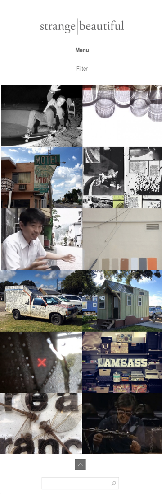
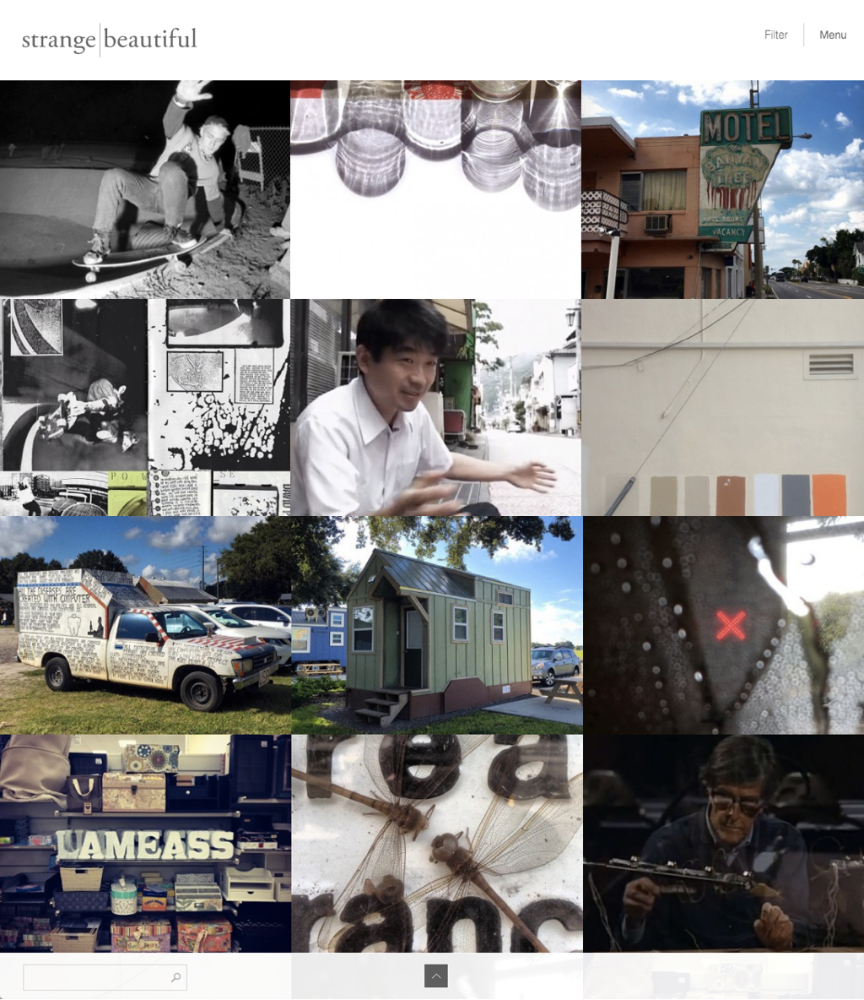
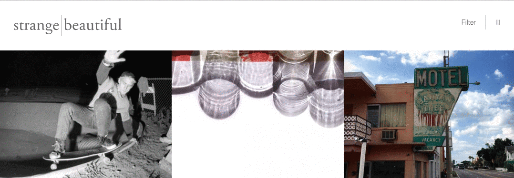

#CSS + SCSS + Mobile-First Responsive Layouts

##Description
Simple & Beautiful is an archive of interesting works combined from several artists' feeds. We are tasked with the assignment of building a responsive, static site on mobile, mid-sized, and large-sized screens.

<hr>
##Objectives

###Learning Objectives

After completing this assignment, you should be able to create a responsive, mobile-first layout.

###Performance Objectives

You should:
- use media-queries with `min-width` breakpoints  
- use the inline-block technique for aligning columns
- use fluid widths (%) on columns so that they dynamically adjust to screen width
- make use of SCSS features:  variables, mixins, and nesting
- be mindful of margin and padding and when/where to use them

##Deliverables 
- an `index.html` file with the content

- a site that has a responsive layout for
  - mobile (< 768px)
  - tablet (768px - 992px)
  - desktop (> 992px)

- a Github repository

<hr>

##Mockups
###The mobile layout


<hr>
###The tablet layout


<hr>
###The full-screen layout


<hr>
##Setup
1. In the Terminal, go to your `~/TIY/assignments`
2. Make a folder for whatever number this assignment is (e.g. `assignment-06`)
3. Change directories into the project's assignment folder that you just created
4. Install the images with the curl command + unzip 
  - In Terminal:
  ```sh
  curl https://raw.githubusercontent.com/TIY-Charleston-Front-End-Engineering/Course-Guide/master/assignments/responsive-layout-strange-beautiful/images.zip > images.zip

  unzip images.zip
  ```
5. Create the project files: (index.html, css folder, style.css file)


## Notes
**(1) Apply some useful CSS style rules**
```css
* {
    box-sizing: border-box
}

img{
   width: 100%;
   display: block;
}
```

**(2) Designer Notes**
+ font-family is sans-serif


###Adventure Mode
Create a menu that appears on hover for the desktop version.

